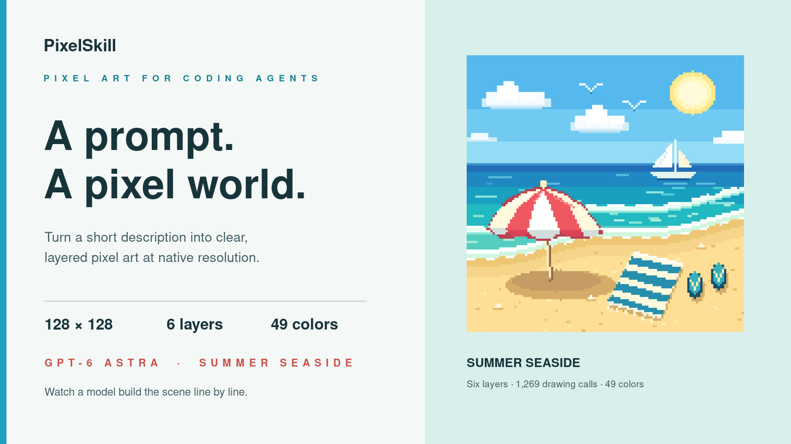

# PixelSkill

Create crisp, grid-aligned pixel art with a coding agent. PixelSkill turns a
short description into a layered illustration and exports the finished artwork
as a native-size PNG and a **4×** preview. It runs on standard Python without
installing packages.

[](promo/pixelskill-beach-demo.mp4)

## Example

GPT-6 Astra created this **128×128 summer seaside** scene in six layers with
49 colors. [Watch the drawing process](promo/pixelskill-beach-demo.mp4).

## Install

```bash
git clone https://github.com/Shanghaitech-DataTech/PixelSkill.git
mkdir -p ~/.agents/skills
cp -r PixelSkill/skills/astra-pixel-art ~/.agents/skills/
# Claude Code does not read ~/.agents/skills; give it a link
mkdir -p ~/.claude/skills
ln -sfn ~/.agents/skills/astra-pixel-art ~/.claude/skills/astra-pixel-art
```

`~/.agents/skills/` is read by Codex, Cursor, Gemini CLI, Copilot, OpenCode,
Amp, Windsurf, Zed and DSH. Requires Python 3.9+ and nothing else; Pillow is
optional, only for importing a JPEG or GIF to pixelate.

Then just ask for pixel art — the skill triggers on its own.

## What you get

- **Canvases are layers.** Draw each element on its own canvas, then
  `flatten([...])` them. Export is `save("name")` — 1× and 4× PNG.
- **Pixels, rectangles, circles, ellipses, polygons, lines, flood fill,
  mirror, shift, dithering, and a built-in 5×7 font.** Curves, arcs, rounded
  corners and multi-part outlines come from one call that takes SVG path
  data — `path("M8 24 C8 8 40 8 40 24 A6 6 0 0 1 34 30 Z", "#e0455a")` —
  with no SVG renderer and nothing to install. `outline()` rims a sprite so
  it reads on any background. Alpha compositing across layers, PNG import,
  and an indexed-PNG export mode. `pixelart help` lists it all.
- **Portable by design.** The drawing engine uses standard Python and creates
  PNG artwork without a server or third-party runtime packages.

The reasoning behind the design, and what was rejected, is in
[AGENTS.md](AGENTS.md).

## Development

```bash
bash tests/verify.sh
```

The checks run the real CLI with the system `python3`, no virtualenv and
nothing installed. Exports are decoded with an independent reader, so the
encoder never checks itself.

## Licence

MIT — see [LICENSE](LICENSE). The 5×7 bitmap font is the one borrowed part:
third-party MIT code, with the notice in
[THIRD_PARTY_NOTICES.md](THIRD_PARTY_NOTICES.md). Everything else — the canvas
engine, the PNG codec, the session log, the preview handling — was written
for this project.
